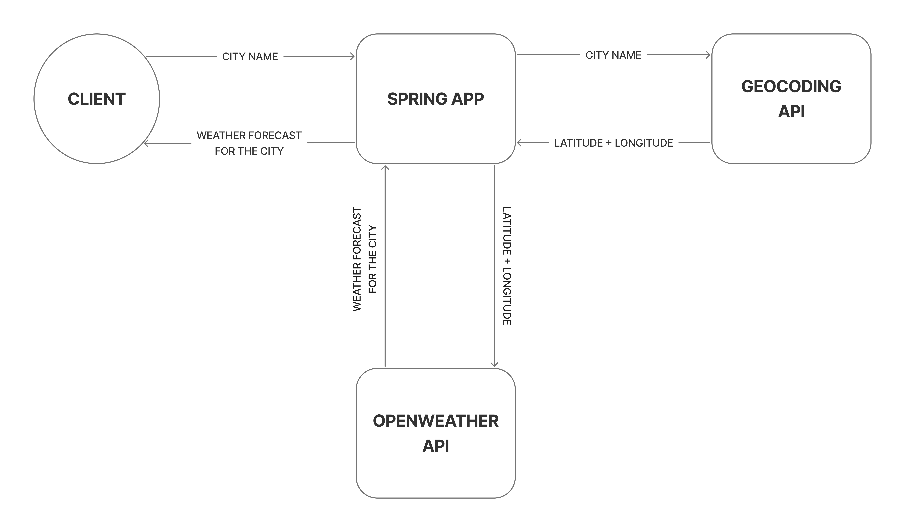

# **Weather-API Project**

## **Outcomes for the project**
- To build a working weather-api
- To handle exceptions for the common cases
- To apply logging on method execution
- To test the endpoints through Postman
- To learn and apply Docker concepts
- *To implement test cases using JUnit